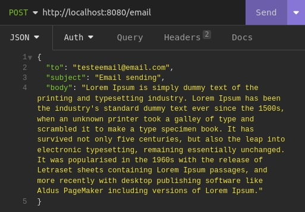
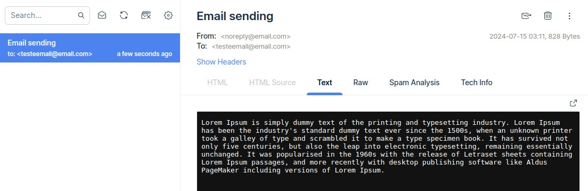

# Send Email

## API com a finalidade de enviar e-mails para testes usando a ferramenta MailTrap.

Este projeto foi construído com **Java, Springboot e [MailTrap](https://mailtrap.io/).**

## Índice

- [Instalação API](#instalação-api)
- [API Endpoints](#api-endpoints)
- [Insomnia](#insomnia)
- [Sobre](#sobre)

## Instalação API

1. Clonar o repositório:

```bash
git clone https://github.com/thomasgsquinaia/send_email_api
```

2. Configure o arquivo `application.properties` no seu projeto conforme o exemplo abaixo, utilizando as variáveis de ambiente. É importante adicionar o nome de usuário e a senha nas variáveis `spring.mail.username=` e `spring.mail.password=`. Para obter esses dados, acesse o site do [MailTrap](https://mailtrap.io/), crie uma Caixa de Entrada (Inbox) e copie as informações de nome de usuário e senha na aba de SMTP. Dessa forma, você poderá rodar o projeto sem intercorrências.

```yaml
spring.mail.host=sandbox.smtp.mailtrap.io
spring.mail.port=465
spring.mail.username=
spring.mail.password=
spring.mail.properties.mail.smtp.auth=true
spring.mail.properties.mail.smtp.starttls.enable=true
```

## API Endpoints
A API fornece os seguintes endpoints:

**EMAIL**
```markdown
POST /email - Envio de e-mail - {to, subject, body}  
```

## Insomnia

Se optar por fazer as solicitações usando o Insomnia, é necessário importar todas as coleções de solicitações a partir do arquivo `insomnia_send_email.json` localizado na raiz do projeto. 

<p align="center">
    
    
</p>

## Sobre

Linkedin: https://www.linkedin.com/in/thomas-quinaia-82b5221b1/